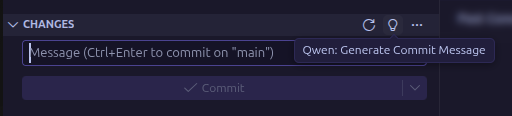

# Qwen Commit

AI-powered commit message generator for VS Code using Qwen CLI.



## Features

- 🤖 **AI-Generated Commit Messages** - Automatically generates commit messages based on your code changes using Qwen AI
- 📝 **Conventional Commits** - Follows industry-standard Conventional Commits specification
- 🎯 **Smart Integration** - Seamlessly integrates with VS Code's Source Control panel
- 🌍 **Multi-language Support** - Available in English and Russian
- ⚡ **Fast & Efficient** - Uses local Qwen CLI for quick generation
- 🛑 **Cancellable** - Stop generation at any time

## Requirements

- [Qwen CLI](https://github.com/QwenLM/qwen-code) must be installed and available in your system PATH
- Git repository initialized in your workspace

## Installation

### From VS Code Marketplace

1. Open VS Code
2. Go to Extensions (Ctrl+Shift+X)
3. Search for "Qwen Commit"
4. Click Install

### From VSIX

1. Download the latest `.vsix` file from releases
2. Open VS Code
3. Go to Extensions (Ctrl+Shift+X)
4. Click "..." menu → "Install from VSIX..."
5. Select the downloaded file

### Install Qwen CLI

See installation instructions at [Qwen CLI repository](https://github.com/QwenLM/qwen-code).

## Development

### Prerequisites

- Node.js 18+ and npm/yarn
- VS Code

### Setup

```bash
# Clone the repository
git clone https://github.com/darqus/qwen-commit-pub.git
cd qwen-commit-pub

# Install dependencies
npm install
# or
yarn install
```

### Build

```bash
# Compile TypeScript
npm run compile
# or
yarn compile

# Watch mode for development
npm run watch
# or
yarn watch
```

### Package

```bash
# Create VSIX package
npm run package
# or
yarn package
```

### Install Locally

```bash
# Build and install in one command
npm run build-and-install
# or
yarn build-and-install

# Or manually install the VSIX
code --install-extension qwen-commit-0.0.1.vsix
```

### Update Dependencies

```bash
# Update all dependencies
npm update
# or
yarn upgrade

# Check for outdated packages
npm outdated
# or
yarn outdated
```

## Usage

### Generate Commit Message

1. Make changes to your code
2. Open Source Control panel (Ctrl+Shift+G)
3. Click the Qwen icon in the Changes section
4. Wait for AI to generate the commit message
5. Review and commit

### Keyboard Shortcuts

- Generate commit message: Click Qwen icon in Source Control
- Stop generation: Click stop icon during generation

## Commit Message Format

Generated messages follow Conventional Commits:

```
<type>(<scope>): <subject>

<body>
```

**Types:**

- `feat` - New feature
- `fix` - Bug fix
- `docs` - Documentation
- `style` - Code style changes
- `refactor` - Code refactoring
- `perf` - Performance improvements
- `test` - Tests
- `chore` - Maintenance tasks
- `ci` - CI/CD changes
- `build` - Build system changes

**Example:**

```
feat(auth): add JWT token validation

Implement JWT token validation middleware to secure API endpoints.
Includes token expiration check and signature verification.
```

## Configuration

Currently, the extension works out of the box with Qwen CLI. Future versions will include customizable settings.

## Troubleshooting

### "Qwen CLI not found"

Make sure Qwen CLI is installed and available in your PATH:

```bash
qwen --version
```

### "No changes to commit"

Make sure you have uncommitted changes in your Git repository.

### "Git extension not found"

Ensure VS Code's built-in Git extension is enabled.

## Contributing

Contributions are welcome! Please feel free to submit a Pull Request.

## License

MIT

## Credits

Powered by [Qwen AI](https://github.com/QwenLM/Qwen) by Alibaba Cloud.
